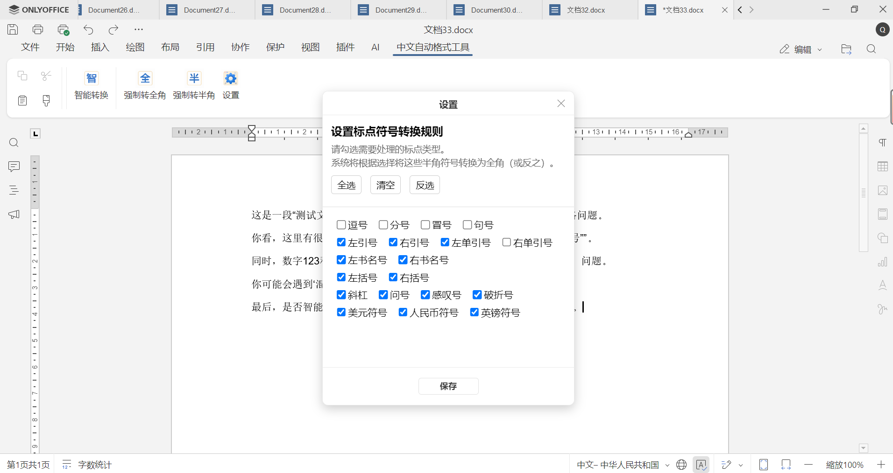

# CAF Tool — Chinese Auto-Formatting (ONLYOFFICE Plugin)

A lightweight ONLYOFFICE plugin tailored for Chinese writing. It automatically checks and fixes common typography issues such as punctuation style, spacing between CJK and Latin text, and stray spaces — perfect for keeping your documents neat and consistent.

> Current version: see `CHANGELOG.md`

## 🚀 Feature Overview

- **Smart Conversion**: detect and fix formatting issues in Chinese text
  - **Optional**: missing space between Chinese and Latin text/numbers
  - **Optional**: missing space between numbers and units (e.g., “10kg” → “10 kg”)
  - **Optional**: missing space before percent sign (e.g., “30%” → “30 %”)
  - **Optional**: one-click toggle for numbers and Latin letters (full-width ⇄ half-width)
  - **Full-width unification**: normalize half-width punctuation to full-width (e.g., “,” → “，”)
  - **Extra spaces cleanup**: collapse consecutive spaces
  - **Ellipsis normalization**: `...` / `…` → standard Chinese `……`
- **Force Full-Width**: convert all punctuation in the selection to full-width
- **Force Half-Width**: convert all punctuation in the selection to half-width
- **Format Report**: visual list of issues with user-controlled replacement
- **Customizable Rules**: choose which punctuation/types to convert in **Settings**

## 🖼️ UI Preview

📌 **Toolbar button**  
_The plugin appears under a dedicated tab._

📋 **Settings (setting.html)**  
_Choose which symbols/rules to apply._  

📝 **Format Report (report.html)**  
  

## 🛠️ How to Use

1. Clone the project and deploy it to an ONLYOFFICE environment that supports plugins.
2. Open a Word document and click **Chinese Auto-Formatting Tool** in the toolbar.
3. Use the following actions as needed:
   - `Smart Conversion`
   - `Force Full-Width`
   - `Force Half-Width`
   - `Settings` (configure which items to convert)

## ✅ Rule Summary (defined in `formatChecker.js`)

- `spaceBetweenMixedLang`: missing space between Chinese and Latin text/numbers
- `numberUnitSpacing`: number followed immediately by a unit
- `percentSpacing`: missing space before the percent sign
- `fullwidthPunctuation`: non-standard half-width punctuation
- `trimExtraSpaces`: consecutive spaces (2+)

## 💡 For Developers

- Built on the ONLYOFFICE plugin framework (`sdkjs-plugins`).
- Document interaction via `Api.GetSelectedText()` / `Api.ReplaceTextSmart()`.
- In `config.json`, the plugin GUID is `asc.{c3a4b670-9e25-41f8-9d6e-4f7d7d5e1c33}` and Word editor is supported.

## 📦 Compatibility

- ✅ ONLYOFFICE Desktop Editors / Web Document Server
- ✅ Responsive plugin panels that adapt to different window sizes

---

If you find this plugin helpful, please ⭐ Star, 🍴 Fork, and open Issues!
