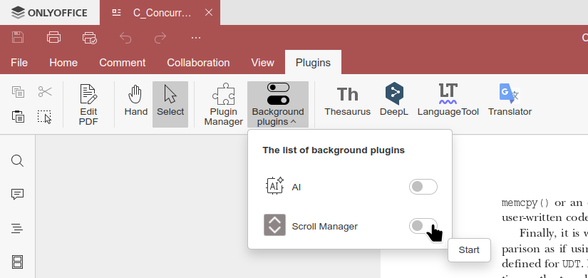
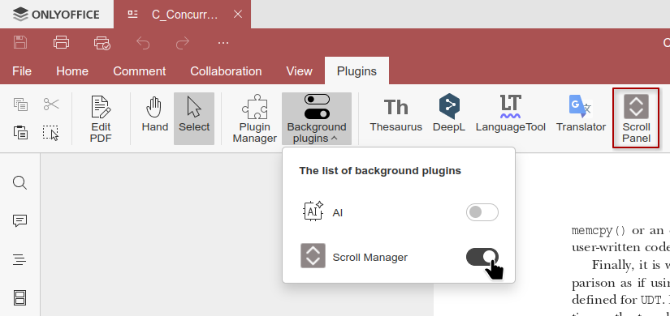
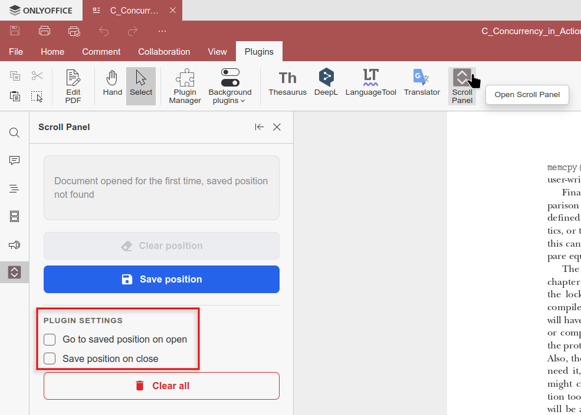
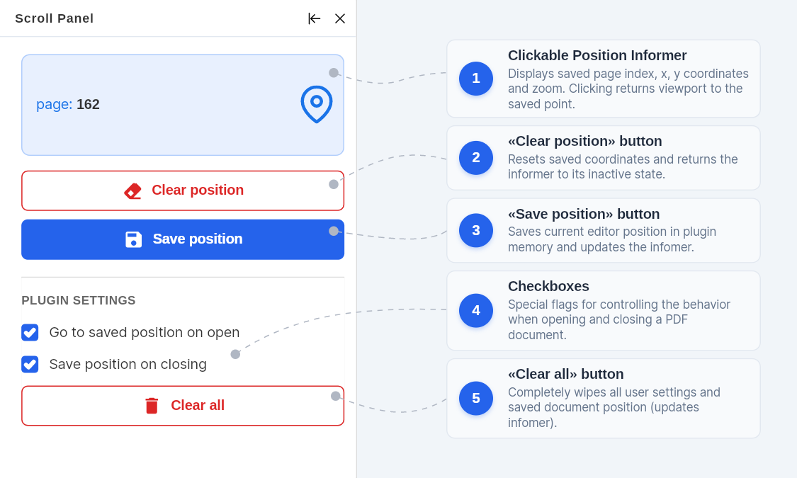

# scroll-manager
Plugin for automatic saving and restoring of scroll position in PDF documents.  
Provides a side panel for quick navigation and saving settings.  

## Setup Instructions
For this plugin to function correctly, you need to configure a couple of essential settings inside ONLYOFFICE before using it. Follow the steps below:

### 1. Go to the Plugins tab and turn on Background plugin.
Go to the **Plugins** tab and turn on that background plugin. As a result, a new Scroll Panel button will appear on the toolbar to open the sidebar.

### 2. Configure Macro Execution Settings
Clicking **Scroll Panel** opens the sidebar on the left. By default, all configuration options remain unchecked. To enable automatic scrolling and position saving, check the corresponding boxes.

## Description of the **Scroll Panel** interface and control elements:

